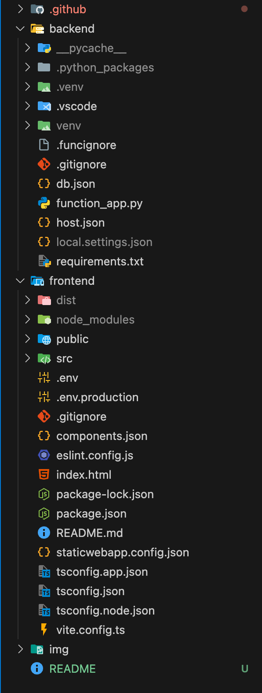
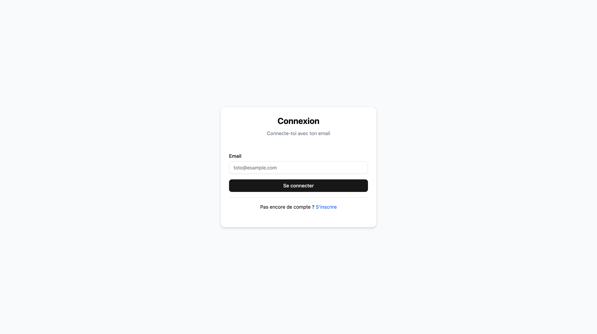
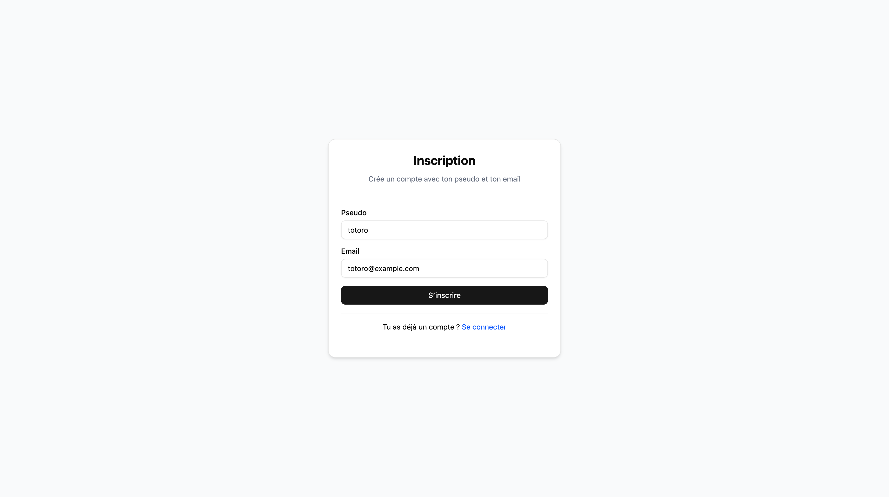
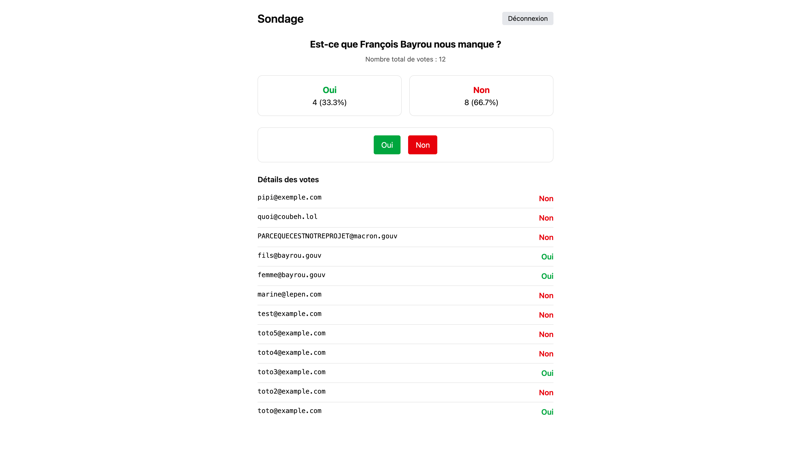
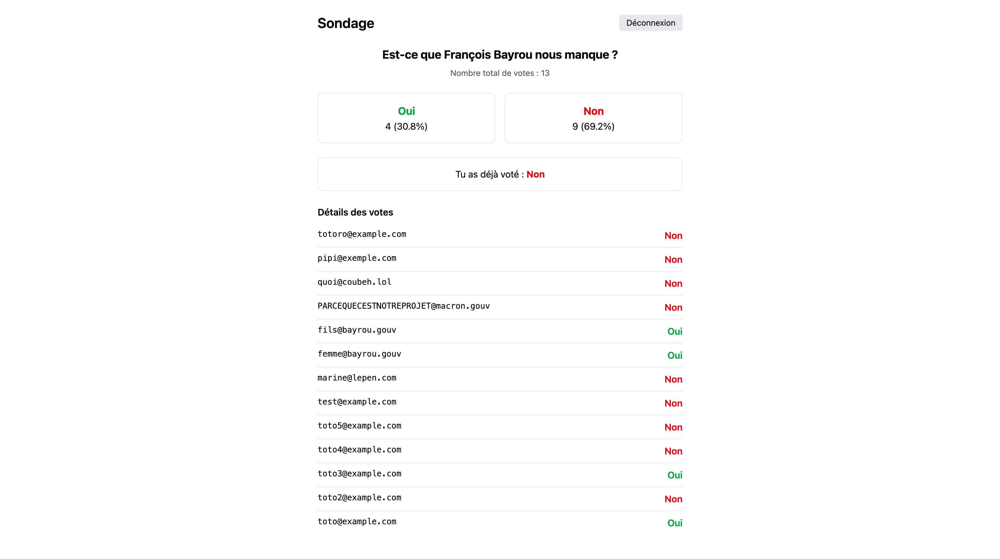

# 🗳️ Bayrou Meter – Application de Vote

## 🌍 Déploiement

L’application est accessible en ligne à l’adresse suivante :  
👉 [https://red-rock-024c87003.2.azurestaticapps.net/](https://red-rock-024c87003.2.azurestaticapps.net/)

---

## 📐 Architecture de l’application

L’application est composée de deux parties :

- **Backend (Azure Functions, Python)** : gère les utilisateurs et les votes, stockés dans **Azure Cosmos DB**.
- **Frontend (Vite + React + TypeScript)** : interface utilisateur web qui consomme les API exposées par le backend.

### Schéma d’architecture



---

## 🔗 Endpoints disponibles (API REST)

Base URL :  
`https://func-azmeter-api-e8bxdwb8f3d0bhhq.francecentral-01.azurewebsites.net/api/`

### 1. 👤 Créer un utilisateur
`POST /user`

**Body JSON :**
```json
{
  "pseudo": "John",
  "email": "john@example.com"
}
```
**Réponses :**
```
201 → Utilisateur créé
409 → Utilisateur déjà existant
400 → Paramètres manquants
```

### 2. 🔑 Connexion utilisateur
`POST /login`

**Body JSON :**
```json
{
  "email": "john@example.com"
}
```
**Réponses :**
```
200 → Retourne les infos utilisateur
404 → Utilisateur non trouvé
```

### 3. 🗳️ Créer un vote
`POST /vote`

**Body JSON :**
```json
{
  "user_id": "john@example.com",
  "choice": "Oui"
}
```
choice doit être "Oui" ou "Non".

**Réponses :**
```
201 → Vote enregistré
400 → Paramètres manquants / invalides
404 → Utilisateur non trouvé
```

### 4. 📊 Récupérer les votes
`GET /votes`

**Réponses :**
```
200 → Retourne la liste des votes (JSON array)
```

---

## ⚙️ Exécution locale

### 1. Backend (Azure Functions + Python)
```
cd backend
```
#### Créer et activer l’environnement virtuel
```
python -m venv venv

source venv/bin/activate   # Linux/Mac

venv\Scripts\activate      # Windows
```
#### Installer les dépendances
```
pip install -r requirements.txt
```
#### Lancer les fonctions
```
func start
```
L’API est dispo en local sur http://localhost:7071/api.


### 2. Frontend (React + Vite + TS)
```
cd frontend
```
#### Installer les dépendances
```
npm install
```
#### Lancer en mode développement
```
npm run dev
```
---

## 📸 Captures d’écran









---

## 📌 Notes
- Les clés Cosmos DB et variables d’environnement doivent être définies dans **local.settings.json** pour exécuter le backend en local.
